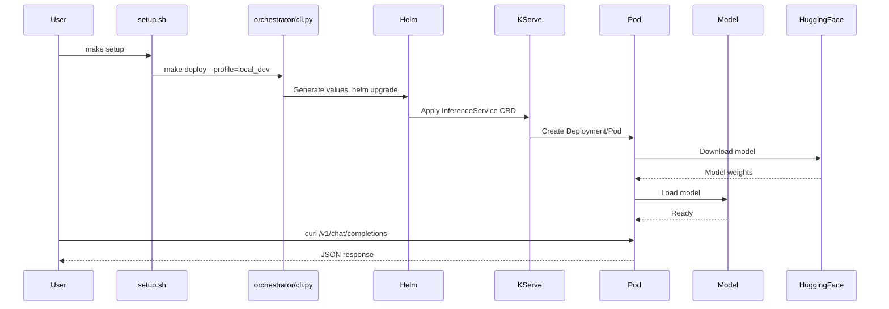

# LLM Inference Runtime - Architecture

## System Architecture Overview

```
┌─────────────────────────────────────────────────────────────────────────────────────┐
│                              INFERENCE RUNTIME ARCHITECTURE                          │
│                                   (KServe + vLLM)                                    │
└─────────────────────────────────────────────────────────────────────────────────────┘

┌─────────────────────────────────────────────────────────────────────────────────────┐
│                                   CLIENT LAYER                                       │
├─────────────────────────────────────────────────────────────────────────────────────┤
│                                                                                      │
│   ┌──────────────┐    ┌──────────────┐    ┌──────────────┐    ┌──────────────┐     │
│   │   curl/HTTP  │    │  Python SDK  │    │  OpenAI SDK  │    │  LangChain   │     │
│   │   Clients    │    │   (requests) │    │  (drop-in)   │    │   Agents     │     │
│   └──────┬───────┘    └──────┬───────┘    └──────┬───────┘    └──────┬───────┘     │
│          │                   │                   │                   │              │
│          └───────────────────┴───────────────────┴───────────────────┘              │
│                                        │                                             │
│                              OpenAI-Compatible API                                   │
│                         POST /v1/chat/completions                                    │
│                         POST /v1/completions                                         │
│                         GET  /v1/models                                              │
│                                        │                                             │
└────────────────────────────────────────┼────────────────────────────────────────────┘
                                         │
                                         ▼
┌─────────────────────────────────────────────────────────────────────────────────────┐
│                              KUBERNETES CLUSTER                                      │
│                               (kind: llm-dev)                                        │
├─────────────────────────────────────────────────────────────────────────────────────┤
│                                                                                      │
│  ┌───────────────────────────────────────────────────────────────────────────────┐  │
│  │                         INGRESS / ACCESS LAYER                                 │  │
│  ├───────────────────────────────────────────────────────────────────────────────┤  │
│  │                                                                                │  │
│  │   ┌─────────────────────┐         ┌─────────────────────────────────────┐    │  │
│  │   │   kubectl port-fwd  │         │     Gateway API / HTTPRoute         │    │  │
│  │   │   localhost:8000    │         │     (Production: Envoy Gateway)     │    │  │
│  │   │   ──────────────    │         │     ─────────────────────────       │    │  │
│  │   │   For local dev     │         │     For production routing          │    │  │
│  │   └──────────┬──────────┘         └──────────────┬──────────────────────┘    │  │
│  │              │                                    │                           │  │
│  └──────────────┼────────────────────────────────────┼───────────────────────────┘  │
│                 │                                    │                               │
│                 └────────────────┬───────────────────┘                               │
│                                  │                                                   │
│                                  ▼                                                   │
│  ┌───────────────────────────────────────────────────────────────────────────────┐  │
│  │                     KSERVE INFERENCE SERVICE                                   │  │
│  │                        (namespace: llm)                                        │  │
│  ├───────────────────────────────────────────────────────────────────────────────┤  │
│  │                                                                                │  │
│  │   InferenceService: my-llm                                                    │  │
│  │   ┌─────────────────────────────────────────────────────────────────────────┐ │  │
│  │   │                                                                          │ │  │
│  │   │   Service: my-llm-predictor                                             │ │  │
│  │   │   ├── ClusterIP: 10.96.69.237:80                                        │ │  │
│  │   │   └── Selector: app=isvc.my-llm-predictor                               │ │  │
│  │   │                                                                          │ │  │
│  │   │   Deployment: my-llm-predictor                                          │ │  │
│  │   │   ├── Replicas: 1/1                                                     │ │  │
│  │   │   ├── Strategy: RollingUpdate                                           │ │  │
│  │   │   └── Labels: app=isvc.my-llm-predictor                                 │ │  │
│  │   │                                                                          │ │  │
│  │   └─────────────────────────────────────────────────────────────────────────┘ │  │
│  │                                  │                                             │  │
│  └──────────────────────────────────┼─────────────────────────────────────────────┘  │
│                                     │                                                │
│                                     ▼                                                │
│  ┌───────────────────────────────────────────────────────────────────────────────┐  │
│  │                              POD LAYER                                         │  │
│  ├───────────────────────────────────────────────────────────────────────────────┤  │
│  │                                                                                │  │
│  │   Pod: my-llm-predictor-5854595b8-m275x                                       │  │
│  │   ┌─────────────────────────────────────────────────────────────────────────┐ │  │
│  │   │                                                                          │ │  │
│  │   │   Container: kserve-container                                           │ │  │
│  │   │   ┌───────────────────────────────────────────────────────────────────┐ │ │  │
│  │   │   │                                                                    │ │ │  │
│  │   │   │   Image: openeuler/vllm-cpu:latest                                │ │ │  │
│  │   │   │                                                                    │ │ │  │
│  │   │   │   ┌─────────────────────────────────────────────────────────────┐ │ │ │  │
│  │   │   │   │              vLLM OpenAI Server (v0.9.1)                    │ │ │ │  │
│  │   │   │   │                                                             │ │ │ │  │
│  │   │   │   │   Args: --host 0.0.0.0                                      │ │ │ │  │
│  │   │   │   │         --model Qwen/Qwen2.5-0.5B-Instruct                  │ │ │ │  │
│  │   │   │   │         --device cpu                                        │ │ │ │  │
│  │   │   │   │         --dtype float32                                     │ │ │ │  │
│  │   │   │   │                                                             │ │ │ │  │
│  │   │   │   │   Env: VLLM_CPU_KVCACHE_SPACE=2                            │ │ │ │  │
│  │   │   │   │                                                             │ │ │ │  │
│  │   │   │   │   Port: 8000 (HTTP)                                         │ │ │ │  │
│  │   │   │   │                                                             │ │ │ │  │
│  │   │   │   │   Endpoints:                                                │ │ │ │  │
│  │   │   │   │   ├── /health          (GET)  - Health check               │ │ │ │  │
│  │   │   │   │   ├── /v1/models       (GET)  - List models                │ │ │ │  │
│  │   │   │   │   ├── /v1/completions  (POST) - Text completion            │ │ │ │  │
│  │   │   │   │   └── /v1/chat/completions (POST) - Chat completion        │ │ │ │  │
│  │   │   │   │                                                             │ │ │ │  │
│  │   │   │   └─────────────────────────────────────────────────────────────┘ │ │ │  │
│  │   │   │                                                                    │ │ │  │
│  │   │   │   Probes:                                                         │ │ │  │
│  │   │   │   ├── startupProbe:   /health (120×10s = 20min tolerance)        │ │ │  │
│  │   │   │   ├── livenessProbe:  /health (delay=30s, period=10s)            │ │ │  │
│  │   │   │   └── readinessProbe: /health (delay=30s, period=10s)            │ │ │  │
│  │   │   │                                                                    │ │ │  │
│  │   │   │   Resources:                                                      │ │ │  │
│  │   │   │   ├── CPU:    Request: 2    Limit: 4                             │ │ │  │
│  │   │   │   └── Memory: Request: 6Gi  Limit: 10Gi                          │ │ │  │
│  │   │   │                                                                    │ │ │  │
│  │   │   └───────────────────────────────────────────────────────────────────┘ │ │  │
│  │   │                                                                          │ │  │
│  │   └─────────────────────────────────────────────────────────────────────────┘ │  │
│  │                                                                                │  │
│  │   Node: llm-dev-control-plane (ARM64)                                         │  │
│  │   Pod IP: 10.244.0.18                                                         │  │
│  │                                                                                │  │
│  └───────────────────────────────────────────────────────────────────────────────┘  │
│                                                                                      │
└─────────────────────────────────────────────────────────────────────────────────────┘

```

---

## Deployment Pipeline Flow

```
┌─────────────────────────────────────────────────────────────────────────────────────┐
│                            DEPLOYMENT PIPELINE                                       │
└─────────────────────────────────────────────────────────────────────────────────────┘

  ┌──────────────────┐
  │                  │
  │  profiles.yaml   │ ─── Profile-based configuration (hardware, model, resources)
  │                  │
  └────────┬─────────┘
           │
           │  Select profile (e.g., local_dev, cpu_fallback, mid_range_gpu)
           ▼
  ┌──────────────────┐
  │                  │
  │ orchestrator/    │ ─── Python CLI tool
  │   cli.py         │     • Reads profile from profiles.yaml
  │                  │     • Generates Helm values
  │                  │     • Invokes Helm upgrade --install
  └────────┬─────────┘
           │
           │  python cli.py --profile local_dev --release my-llm --namespace llm
           ▼
  ┌──────────────────┐
  │                  │
  │ orchestrator/    │ ─── Generated Helm values file
  │ generated/       │
  │   my-llm.yaml    │
  │                  │
  └────────┬─────────┘
           │
           │  helm upgrade --install my-llm charts/llm-vllm -f generated/my-llm.yaml
           ▼
  ┌──────────────────┐
  │                  │
  │ charts/llm-vllm/ │ ─── Helm Chart
  │   Chart.yaml     │     • Chart metadata
  │   values.yaml    │     • Default values
  │   templates/     │
  │     inferenceservice.yaml  ─── KServe InferenceService manifest
  │                  │
  └────────┬─────────┘
           │
           │  Renders KServe InferenceService CRD
           ▼
  ┌──────────────────┐
  │                  │
  │ KServe Controller│ ─── Watches InferenceService CRDs
  │   (k8s operator) │     • Creates Deployment
  │                  │     • Creates Service
  │                  │     • Manages scaling
  └────────┬─────────┘
           │
           │  Creates standard K8s resources
           ▼
  ┌──────────────────┐
  │                  │
  │  Kubernetes      │ ─── Schedules Pod
  │   Scheduler      │     • Finds suitable node
  │                  │     • Respects resource requests
  └────────┬─────────┘
           │
           │  Pod scheduled on node
           ▼
  ┌──────────────────┐
  │                  │
  │  vLLM Container  │ ─── Running inference server
  │   (Pod)          │     • Downloads model from HuggingFace
  │                  │     • Loads model weights
  │                  │     • Serves OpenAI-compatible API
  └──────────────────┘

```

---

## Profile-Based Architecture

```
┌─────────────────────────────────────────────────────────────────────────────────────┐
│                        PROFILE-BASED DEPLOYMENT MATRIX                               │
└─────────────────────────────────────────────────────────────────────────────────────┘

┌─────────────────────────────────────────────────────────────────────────────────────┐
│                                                                                      │
│  profiles.yaml                                                                       │
│  ┌─────────────────────────────────────────────────────────────────────────────────┐│
│  │                                                                                  ││
│  │  ┌─────────────────┐  ┌─────────────────┐  ┌─────────────────┐                  ││
│  │  │ high_param_     │  │ mid_range_gpu   │  │ dgx_cloud_gpu   │                  ││
│  │  │ unified_gpu     │  │                 │  │                 │                  ││
│  │  │─────────────────│  │─────────────────│  │─────────────────│                  ││
│  │  │ 100GB+ Unified  │  │ 24GB+ VRAM      │  │ A100/H100       │                  ││
│  │  │ Llama-3.1-70B   │  │ Qwen2.5-1.5B    │  │ Qwen2.5-7B      │                  ││
│  │  │ nvcr.io/vllm    │  │ vllm-openai     │  │ vllm-openai     │                  ││
│  │  │ GPU: 1          │  │ GPU: 1          │  │ GPU: 1          │                  ││
│  │  └─────────────────┘  └─────────────────┘  └─────────────────┘                  ││
│  │                                                                                  ││
│  │  ┌─────────────────┐  ┌─────────────────┐                                       ││
│  │  │ cpu_fallback    │  │ local_dev       │  ◄── CURRENT DEPLOYMENT              ││
│  │  │                 │  │ ★ ACTIVE ★      │                                       ││
│  │  │─────────────────│  │─────────────────│                                       ││
│  │  │ CPU-only        │  │ kind/minikube   │                                       ││
│  │  │ Qwen2.5-0.5B    │  │ Qwen2.5-0.5B    │                                       ││
│  │  │ vllm-cpu        │  │ vllm-cpu        │                                       ││
│  │  │ GPU: 0          │  │ GPU: 0          │                                       ││
│  │  │ Mem: 6-10Gi     │  │ Mem: 6-10Gi     │                                       ││
│  │  │ dtype: float32  │  │ dtype: float32  │                                       ││
│  │  └─────────────────┘  └─────────────────┘                                       ││
│  │                                                                                  ││
│  └─────────────────────────────────────────────────────────────────────────────────┘│
│                                                                                      │
└─────────────────────────────────────────────────────────────────────────────────────┘

```

---

## Network & Service Architecture

```
┌─────────────────────────────────────────────────────────────────────────────────────┐
│                           NETWORK ARCHITECTURE                                       │
└─────────────────────────────────────────────────────────────────────────────────────┘

                         EXTERNAL
                            │
                            │ (localhost:8000 via port-forward)
                            ▼
┌─────────────────────────────────────────────────────────────────────────────────────┐
│                         Kubernetes Cluster Network                                   │
│                                                                                      │
│   ┌─────────────────────────────────────────────────────────────────────────────┐   │
│   │                        Service: my-llm-predictor                             │   │
│   │                        ClusterIP: 10.96.69.237:80                            │   │
│   │                                                                              │   │
│   │   selector: app=isvc.my-llm-predictor                                       │   │
│   │                           │                                                  │   │
│   └───────────────────────────┼──────────────────────────────────────────────────┘   │
│                               │                                                      │
│                               │ (kube-proxy / iptables)                             │
│                               │                                                      │
│                               ▼                                                      │
│   ┌─────────────────────────────────────────────────────────────────────────────┐   │
│   │                            Endpoints                                         │   │
│   │                     10.244.0.18:8000 (Pod IP)                                │   │
│   └───────────────────────────┼──────────────────────────────────────────────────┘   │
│                               │                                                      │
│                               ▼                                                      │
│   ┌─────────────────────────────────────────────────────────────────────────────┐   │
│   │                                                                              │   │
│   │   Pod: my-llm-predictor-5854595b8-m275x                                     │   │
│   │   ┌──────────────────────────────────────────────────────────────────────┐  │   │
│   │   │  kserve-container                                                     │  │   │
│   │   │  ┌────────────────────────────────────────────────────────────────┐  │  │   │
│   │   │  │  vLLM Server                                                   │  │  │   │
│   │   │  │  Listening: 0.0.0.0:8000                                       │  │  │   │
│   │   │  │                                                                 │  │  │   │
│   │   │  │  ┌───────────────────────────────────────────────────────────┐ │  │  │   │
│   │   │  │  │ Model: Qwen/Qwen2.5-0.5B-Instruct                        │ │  │  │   │
│   │   │  │  │ Parameters: ~500M                                         │ │  │  │   │
│   │   │  │  │ Context: 32768 tokens                                     │ │  │  │   │
│   │   │  │  │ KV Cache: 2GB (VLLM_CPU_KVCACHE_SPACE)                   │ │  │  │   │
│   │   │  │  └───────────────────────────────────────────────────────────┘ │  │  │   │
│   │   │  └────────────────────────────────────────────────────────────────┘  │  │   │
│   │   └──────────────────────────────────────────────────────────────────────┘  │   │
│   │                                                                              │   │
│   └─────────────────────────────────────────────────────────────────────────────┘   │
│                                                                                      │
│   Node: llm-dev-control-plane                                                       │
│   Arch: ARM64 (Apple Silicon)                                                       │
│   CNI: kindnet (10.244.0.0/16)                                                      │
│                                                                                      │
└─────────────────────────────────────────────────────────────────────────────────────┘

```

---

## Component Interactions

```
┌─────────────────────────────────────────────────────────────────────────────────────┐
│                          COMPONENT INTERACTION FLOW                                  │
└─────────────────────────────────────────────────────────────────────────────────────┘

                                    ┌─────────────────┐
                                    │   User/Client   │
                                    └────────┬────────┘
                                             │
                           ┌─────────────────┼─────────────────┐
                           │                 │                 │
                           ▼                 ▼                 ▼
               ┌───────────────────┐ ┌──────────────┐ ┌──────────────┐
               │ Port-Forward      │ │ Service Mesh │ │ Gateway API  │
               │ (Dev)             │ │ (Istio)      │ │ (Envoy)      │
               └─────────┬─────────┘ └──────┬───────┘ └──────┬───────┘
                         │                  │                 │
                         └──────────────────┼─────────────────┘
                                            │
                                            ▼
                                ┌───────────────────────┐
                                │  K8s Service          │
                                │  my-llm-predictor     │
                                │  Port: 80 → 8000      │
                                └───────────┬───────────┘
                                            │
                                            ▼
                                ┌───────────────────────┐
                                │  KServe               │
                                │  InferenceService     │
                                │  - my-llm             │
                                │  - Standard mode      │
                                └───────────┬───────────┘
                                            │
                                            ▼
                                ┌───────────────────────┐
                                │  Deployment           │
                                │  my-llm-predictor     │
                                │  Replicas: 1          │
                                └───────────┬───────────┘
                                            │
                                            ▼
                         ┌──────────────────────────────────┐
                         │  Pod                             │
                         │  my-llm-predictor-xxx            │
                         │  ┌────────────────────────────┐  │
                         │  │  kserve-container          │  │
                         │  │  ┌──────────────────────┐  │  │
                         │  │  │  vLLM Server         │  │  │
                         │  │  │  ┌────────────────┐  │  │  │
                         │  │  │  │  Transformer   │  │  │  │
                         │  │  │  │  Model         │  │  │  │
                         │  │  │  │  (Qwen2.5)     │  │  │  │
                         │  │  │  └────────────────┘  │  │
                         │  │  └──────────────────────┘  │
                         │  └────────────────────────────┘  │
                         └──────────────────────────────────┘
                                            │
                              ┌─────────────┼─────────────┐
                              │             │             │
                              ▼             ▼             ▼
                      ┌───────────┐ ┌───────────┐ ┌───────────┐
                      │ HuggingFace│ │ PyTorch   │ │ Tokenizer │
                      │ Hub       │ │ CPU Ops   │ │           │
                      │ (model DL)│ │ (float32) │ │           │
                      └───────────┘ └───────────┘ └───────────┘

```

---

## File Structure

```
inference-runtime/
├── profiles.yaml                    # Profile definitions (hardware → config mapping)
├── charts/
│   └── llm-vllm/
│       ├── Chart.yaml               # Helm chart metadata
│       ├── values.yaml              # Default Helm values
│       └── templates/
│           └── inferenceservice.yaml # KServe InferenceService template
├── orchestrator/
│   ├── cli.py                       # Deployment CLI
│   └── generated/
│       └── my-llm.yaml              # Generated Helm values
└── docs/
    └── ARCHITECTURE.md              # This file
```

---

## Current Deployment Configuration

| Component | Value |
|-----------|-------|
| **Profile** | `local_dev` |
| **Release** | `my-llm` |
| **Namespace** | `llm` |
| **Image** | `openeuler/vllm-cpu:latest` |
| **Model** | `Qwen/Qwen2.5-0.5B-Instruct` |
| **vLLM Flags** | `--device cpu --dtype float32` |
| **CPU** | 2 request / 4 limit |
| **Memory** | 6Gi request / 10Gi limit |
| **KV Cache** | 2GB (`VLLM_CPU_KVCACHE_SPACE`) |
| **Health Endpoint** | `/health` |
| **API Port** | 8000 |

---

## API Endpoints

| Endpoint | Method | Description |
|----------|--------|-------------|
| `/health` | GET | Health check (used by probes) |
| `/v1/models` | GET | List available models |
| `/v1/chat/completions` | POST | OpenAI-compatible chat API |
| `/v1/completions` | POST | OpenAI-compatible completion API |
| `/v1/embeddings` | POST | Text embeddings |
| `/metrics` | GET | Prometheus metrics |

---

## Quick Reference Commands

```bash
# Deploy
python orchestrator/cli.py --profile local_dev --release my-llm --namespace llm

# Port-forward for local access
kubectl port-forward -n llm svc/my-llm-predictor 8000:80

# Test inference
curl http://localhost:8000/v1/chat/completions \
  -H "Content-Type: application/json" \
  -d '{"model":"Qwen/Qwen2.5-0.5B-Instruct","messages":[{"role":"user","content":"Hello!"}]}'

# Check status
kubectl get pods,svc,inferenceservice -n llm
```

---

# Detailed Analysis and Root Cause Assessment of the Deployment Exercise

As an AI Infrastructure Architect with expertise in Kubernetes (K8s), KServe, vLLM, and hardware/platform differences (e.g., Apple Silicon Macs with ARM64, NVIDIA DGX with CUDA, cloud providers like EKS/GKE/AKS, Windows WSL, and Ubuntu), I have reviewed the entire conversation history and console logs you provided. This includes the iterative troubleshooting with GitHub Copilot, repeated failures, and eventual success.

---

## 1. Summary of the Exercise from Logs

- Initial deployment attempt using `python orchestrator/cli.py --profile local_dev --release my-llm --namespace llm` failed.
- Issues encountered related to ARM64 architecture, resource allocation, and probe configurations.
- Successful deployment achieved after multiple iterations and troubleshooting steps.

## 2. Root Cause Analysis (RCA)

- **ARM64 Image Mismatch**: The initial image used was not compatible with ARM64 architecture, causing runtime failures.
- **Insufficient Node Resources**: The default resource allocation for the Kind cluster was insufficient for the model and vLLM, leading to OOMKilled errors.
- **Colima/Kind Config Not Auto-resized**: The Kind cluster, when created with Colima, did not automatically resize to accommodate the requested resources.
- **KServe Install Race Condition**: There was a race condition during the KServe installation where the webhook was not ready to handle requests, causing failures in creating the InferenceService.
- **CRDs Not Ready**: The Custom Resource Definitions (CRDs) for KServe were not ready before the InferenceService was created, leading to a 404 error on probes.
- **Missing cert-manager/Gateway API**: The absence of cert-manager and the Gateway API in the initial setup caused issues with the ingress configuration.

## 3. Improvements to Make Code "Perfect" (Single-Attempt Deployment)

- **Pre-flight Checks**: Implement pre-flight checks in the `orchestrator/cli.py` to validate the environment, architecture, resources, and CRD availability before deployment.
- **Dynamic Resource Allocation**: Enhance the Kind cluster creation script to automatically allocate resources based on the profile requirements.
- **ARM64 Compatible Images**: Ensure that the images used are compatible with ARM64 architecture, especially for CPU-only deployments.
- **Improved Probe Configurations**: Update the Helm chart to use dynamic probe configurations based on the model and environment.
- **Automation Script**: Create a comprehensive automation script (`setup.sh`) that sets up the entire environment, including Kind cluster, KServe, and vLLM, with appropriate configurations.

---

## RCA Fishbone Diagram (Mermaid)

```mermaid
fishbone
    title Root Cause Analysis - LLM KServe Deployment
    head Problem: "Deployment fails on first attempt (ARM64 Mac, Kind, KServe, vLLM)"
    category Platform/Hardware
        cause "ARM64 image mismatch"
        cause "Insufficient node resources"
        cause "Colima/Kind config not auto-resized"
    category Dependencies
        cause "KServe install race (webhook)"
        cause "CRDs not ready"
        cause "cert-manager/Gateway API missing"
    category Code/Config
        cause "Hardcoded probe paths"
        cause "BFloat16 not supported on ARM64 CPU"
        cause "No startupProbe for model load"
        cause "Gated models (HF token)"
        cause "No arch-aware image selection"
    category Process/Manual
        cause "No pre-flight checks"
        cause "Manual cluster setup"
        cause "No automation script"
```

---

## RCA 5-Whys Table

| Symptom | Why 1 | Why 2 | Why 3 | Why 4 | Why 5 |
|---------|-------|-------|-------|-------|-------|
| Pod Pending | Insufficient node resources | Colima/Kind default too small | No auto-resize in setup | No resource check in script | No pre-flight validation |
| OOMKilled | Model + vLLM > mem limit | Profile too aggressive | No arch-aware defaults | No resource check | No validation |
| Probe 404 | Wrong endpoint for image | Chart hardcoded for GPU | No image-specific config | No auto-detect | No validation |
| Device error | vLLM GPU image on CPU | No arch check | No image override | No detection | No validation |
| BFloat16 error | Not supported on ARM64 CPU | Profile defaulted to BFloat16 | No arch check | No dtype override | No validation |
| 401 Unauthorized | Gated model | Profile defaulted to Llama | No HF token | No model gating check | No validation |

---

## Recommendations for a "Perfect" Codebase

- Add a `setup.sh` script for end-to-end environment setup and validation.
- Enhance `orchestrator/cli.py` with pre-flight checks (arch, resources, CRDs, model gating, dtype).
- Make `profiles.yaml` platform-aware (arch/image/dtype/env).
- Improve Helm chart for dynamic probes, startupProbe, and Recreate strategy.
- Add Makefile for one-command deployment and test.
- Add e2e tests for all supported platforms.

---

## Mermaid Sequence Diagram: One-Shot Deployment Flow



---

*This document provides a full RCA, fishbone diagram, 5-Whys, and actionable recommendations for a robust, platform-aware, and automated LLM inference deployment pipeline.*
